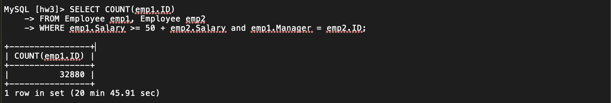
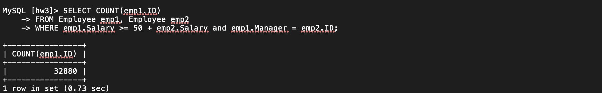
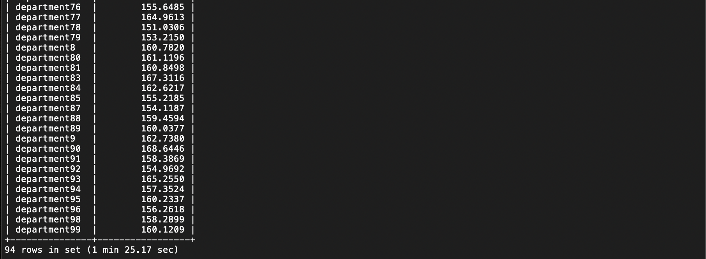
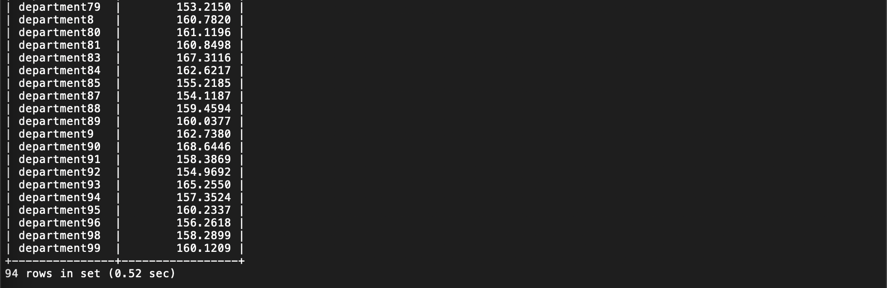
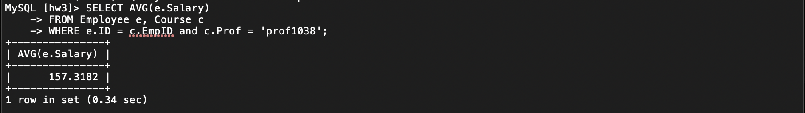
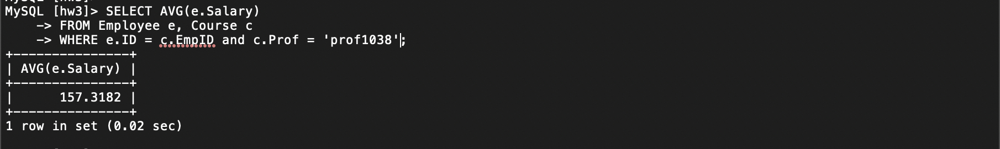

## HOMEWORK 3 -- Question 2
Author:
- Fang Han Cabrera (fh643@nyu.edu)

### Folder Structure

* **commands.sql** contains sql script for questions (a) - (c)

* **/data** contains data input file *emp* and *course*

* **/image** contains screenshots

### Add Indexes

I added BTREE index to both tables using the sql commands below (also included in __commands.sql__)
```
CREATE INDEX course_index ON Course (EmpID) USING BTREE;
CREATE INDEX emp_index ON Employee (ID) USING BTREE;
```

### Timings and Results BEFORE and AFTER adding index

#### (a)

* BEFORE: it was an outrageous 20 mins and more!
    * 


* AFTER:
    * 


* SPEEDUP:
    * Believe it or not, speedup (t_before/t_after) is __1706.8__!

#### (b)

* BEFORE:
    * 


* AFTER:
    * 


* SPEEDUP:
   * 163.79

#### (c)


* BEFORE:
    * 


* AFTER:
    * 


* SPEEDUP:
   * 17


### Results

* (a) Find the number of employees who earn at least 50 more than their managers.

  ```
  +----------------+
  | COUNT(emp1.ID) |
  +----------------+
  |          32880 |
  +----------------+
  ```

* (b) For those departments in which more than one person takes courses, find the average salary by department.
  ```
  +---------------+-----------------+
  | Department    | AVG(emp.Salary) |
  +---------------+-----------------+
  | department1   |        160.5860 |
  | department10  |        154.6738 |
  | department100 |        163.2644 |
  | department11  |        158.2832 |
  | department13  |        157.5294 |
  | department14  |        157.9805 |
  | department15  |        163.4443 |
  | department16  |        165.4646 |
  | department17  |        166.0363 |
  | department18  |        158.0898 |
  | department19  |        161.2179 |
  | department2   |        161.6110 |
  | department20  |        161.6498 |
  | department21  |        161.4905 |
  | department22  |        158.3385 |
  | department24  |        160.6976 |
  | department25  |        158.3143 |
  | department26  |        154.7959 |
  | department27  |        160.9370 |
  | department28  |        158.2989 |
  | department29  |        159.4878 |
  | department3   |        161.9690 |
  | department30  |        155.0152 |
  | department31  |        166.1477 |
  | department32  |        159.2785 |
  | department33  |        162.3730 |
  | department34  |        171.4965 |
  | department35  |        170.0661 |
  | department36  |        162.6129 |
  | department37  |        156.0226 |
  | department38  |        159.7906 |
  | department39  |        162.8597 |
  | department4   |        155.6012 |
  | department40  |        155.9432 |
  | department41  |        165.8314 |
  | department42  |        166.3449 |
  | department43  |        163.9291 |
  | department44  |        161.9389 |
  | department45  |        166.3354 |
  | department46  |        161.5209 |
  | department47  |        157.8337 |
  | department48  |        162.9153 |
  | department5   |        158.5402 |
  | department50  |        156.7714 |
  | department51  |        167.2863 |
  | department52  |        156.9207 |
  | department53  |        160.3990 |
  | department54  |        161.1351 |
  | department55  |        160.2930 |
  | department56  |        160.9630 |
  | department57  |        165.9737 |
  | department58  |        160.3978 |
  | department59  |        156.4767 |
  | department6   |        164.6999 |
  | department60  |        162.0474 |
  | department61  |        161.7849 |
  | department62  |        158.8541 |
  | department63  |        160.4190 |
  | department64  |        158.6670 |
  | department65  |        159.2012 |
  | department66  |        161.5722 |
  | department67  |        161.8793 |
  | department68  |        162.7086 |
  | department69  |        158.6913 |
  | department7   |        159.3139 |
  | department70  |        159.3875 |
  | department71  |        163.8369 |
  | department72  |        159.7276 |
  | department73  |        160.5437 |
  | department74  |        160.0744 |
  | department75  |        153.8161 |
  | department76  |        155.6485 |
  | department77  |        164.9613 |
  | department78  |        151.0306 |
  | department79  |        153.2150 |
  | department8   |        160.7820 |
  | department80  |        161.1196 |
  | department81  |        160.8498 |
  | department83  |        167.3116 |
  | department84  |        162.6217 |
  | department85  |        155.2185 |
  | department87  |        154.1187 |
  | department88  |        159.4594 |
  | department89  |        160.0377 |
  | department9   |        162.7380 |
  | department90  |        168.6446 |
  | department91  |        158.3869 |
  | department92  |        154.9692 |
  | department93  |        165.2550 |
  | department94  |        157.3524 |
  | department95  |        160.2337 |
  | department96  |        156.2618 |
  | department98  |        158.2899 |
  | department99  |        160.1209 |
  +---------------+-----------------+
  ```

* (c) Find the average salary earned by people taking the course of prof1038.
  ```
  +---------------+
  | AVG(e.Salary) |
  +---------------+
  |      157.3182 |
  +---------------+
  ```
