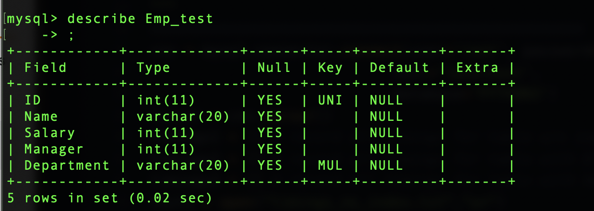
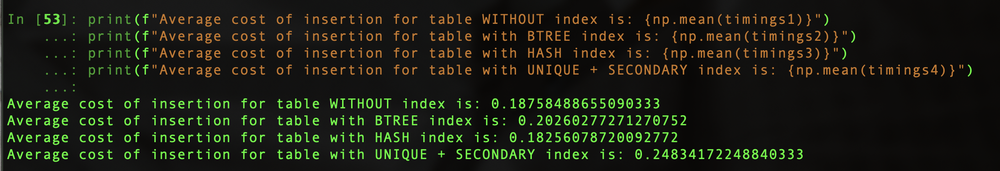
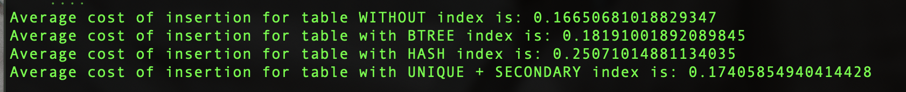
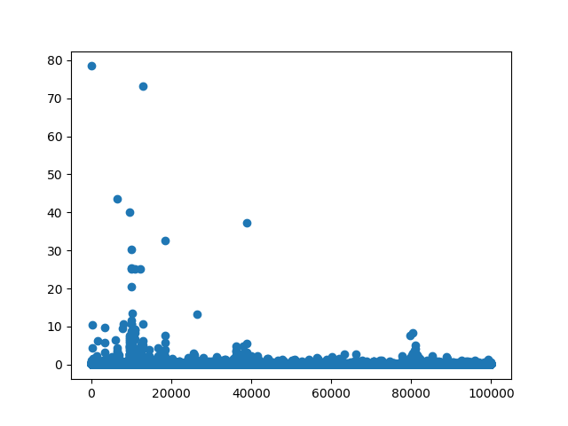
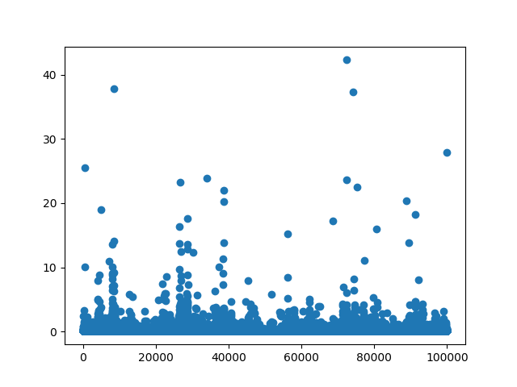

## HOMEWORK 3 -- Question 3
Author:
- Fang Han Cabrera (fh643@nyu.edu)

### Folder Structure

* **driver.py** contains python script for the experiment

* **/timings** contains all the records of timings for each tables

* **/data** contains data input file *emp*

* **/image** contains screenshots

### Setup

#### libraries used

* mysql.connector
* numpy

#### environment

All the python script included in *driver.py* is executed in **ipython**

#### mysql setup

Before establishing connection to *mysql* server using **mysql.connector**, we need to create databases and their corresponding indices in *mysql*.

I created 4 databases, described below:

1. Vanilla table __without__ index, as required by 3(a).
    ```create table Employee(ID int, Name varchar(20), Salary int, Manager int, Department varchar(20));```

1. Table with __unique__ index on _ID_ and a __secondary__ index on _department_, as required by 3(b).
    ```
    create table Emp_test(ID int, Name varchar(20), Salary int, Manager int, Department varchar(20));
    ALTER TABLE Emp_test ADD UNIQUE (ID);
    ALTER TABLE Emp_test ADD INDEX (Department);
    ```
    The resulting table is checked as shown as below:
    

1. An extra table with __BTREE__ index on _ID_ for comparison.
    ```
    create table Emp_btree(ID int, Name varchar(20), Salary int, Manager int, Department varchar(20));
    CREATE INDEX emp_btree_ind ON Emp_btree (ID) USING BTREE;
    ```

1. Another extra table with __HASH__ index on _ID_ for comparison.
    ```
    create table Emp_hash(ID int, Name varchar(20), Salary int, Manager int, Department varchar(20));
    CREATE INDEX emp_hash_ind ON Emp_hash (ID) USING HASH;
    ```


### Experiment

#### code explanation

##### global

* establish connection to mysql with ```cnx = mysql.connector.connect(user, password, host, database)``` command.

* create cursor with ```cursor = cnx.cursor()```.

* lists to record all timings in lists, e.g. ```timings1 = []```

* IO setup, e.g. ```f = open("timings_no_index.txt","w+")```

##### per table

For each of the tables created above, I did the following:

* specify command to be passed onto mysql with table name and schema, e.g.
    ```
    command = ("INSERT INTO <table name> "
                "(ID, Name, Salary, Manager, Department) "               
                "VALUES (%s, %s, %s, %s, %s)")
    ```

* read from __emp__ line by line into ```data``` while passing the resulting command to mysql:
    ```
    cursor.execute(command, data)
    ```

* record time elapsed with python ```time.time()```.

* write time to file using ```f.write()```


### Result

To compare time cost of insertion into each of the tables, I took the mean of all their respective timings recorded, e.g. for the table _without_ index: ```print(f"Average cost of insertion for table WITHOUT index is: {np.mean(timings1)}")```

#### numerical

I conducted two experiments whose results are shown below:

1. 

1. 

It can be seen that insertion into a table with __UNIQUE + SECONDARY__ table costs on average more than a table without __INDEX__.


#### plot

If we plot the timings of inserting into these two tables, some patterns can be observed:

1. table __WITHOUT__ index:

    * the spikes are clustered in the front.

    * 


1. table with __UNIQUE + SECONDARY__

    * the spikes are more scattered in a random fashion.

    * 

#### explanation

*  With clustered (__unique__) index, the primary key and the record itself are “clustered” together, and the records are all stored in primary-key order.

* But under some circumstances, the clustered index can actually degrade performance. When you use one together with a __secondary__ index, the secondary indices point to the primary key rather than the row. Therefore, you will end up with duplicate copies of that primary index, first as the clustered index stored alongside the records themselves, but then again for as many times as you have secondary indexes pointing to those clustered indexes.

* This repeated storage of the primary key plus the overhead of sorting the primary key may have contributed to the longer insertion time.
